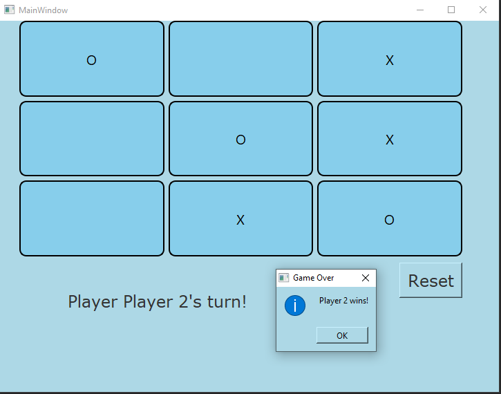

# Tic-Tac-Toe Qt App

This is a basic Tic-Tac-Toe game built using the Qt framework. It features a user-friendly graphical interface that allows two players to play against each other.

 

## Features

- **Two-player mode**: Players take turns placing Xs and Os on a 3x3 grid.
- **Win Detection**: Automatically detects a win, draw, or ongoing game.
- **Reset Game**: Allows players to reset the board and start a new game.

## How to Run

1. **Download and Extract**: Download the project zip file and extract it to your preferred location.
2. **Navigate to Executable Directory**: Go to the folder containing the built executable for the app.
3. **Run the App**: Double-click the executable to start playing Tic-Tac-Toe.

## Technologies Used

- **C++**: Core logic of the game.
- **Qt Framework**: Used for building the graphical user interface (GUI).
